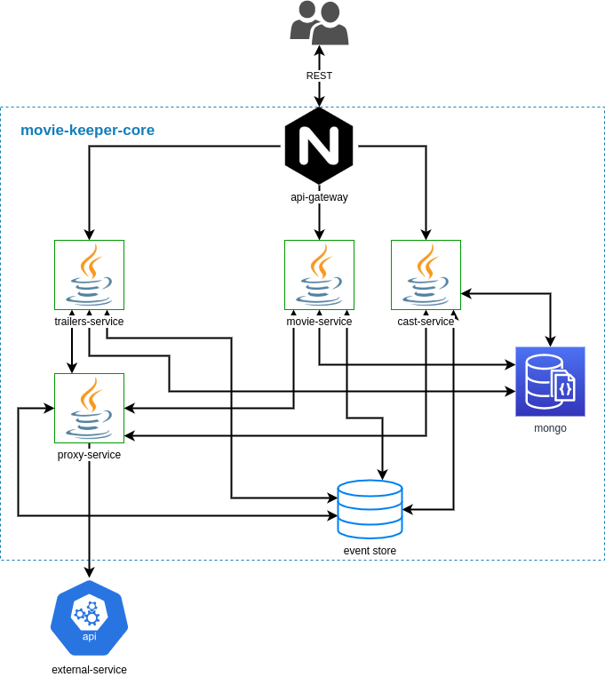

# MovieKeeperCore
[](https://travis-ci.org/matty-matt/movie-keeper-core)

Backend for [MovieKeeper](https://github.com/TheMickeyMike/MovieKeeper) React application that allows storing movies you'd like to watch. 
Digital release dates of your stored movies are tracked by app.

## Prerequisites
* Docker installed
* [TMDb](https://www.themoviedb.org) ApiKey stored in environment variable TMDB_API_KEY

## Architecture


## Launching app
**(prod)** Simply use `docker-compose up --build` to run application in production mode.

**(dev)** When running from IDE, axon-server and mongodb should be launched first:
```
docker-compose up --scale api-gateway=0 --scale movie-service=0 --scale cast-service=0 --scale proxy-service=0 --scale trailer-service=0
```
also proxy-service should have set TMDB_API_KEY in env variable

## Usage
Ports may vary depending on run context (through api-gateway, or directly to microservice):
- Get all movies
  ```
  curl http://localhost:35000/movies
  ```
- Find and store movie
  ```
  curl -X POST -H "Content-Type: application/json" -d '{"title": "Rocky"}' http://localhost:35000/movies
  ```
- Get movie
  ```
  curl http://localhost:35000/movies/{id}
  ```
- Get movie trailers
  ```
  curl http://localhost:35000/movies/{id}/videos
  ```
- Get movie cast
  ```
  curl http://localhost:35000/movies/{id}/cast
  ```
- Mark movie as watched
  ```
  curl -X PUT -H "Content-Type: application/json" -d '{"watched": "false"}' http://localhost:35000/movies/{id}
  ```
- Delete movie
  ```
  curl -X DELETE http://localhost:35000/movies/{id}
  ```
- Force refresh votes and release dates for all not seen movies
  ```
  curl -X PUT http://localhost:35000/refresh
  ```
